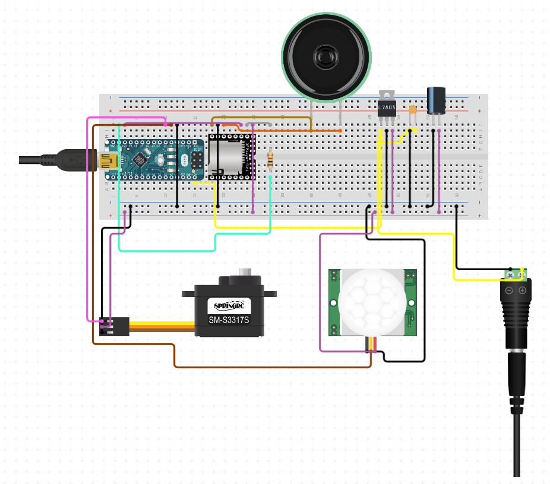

# SoldierArmuino
Small project developed as a commission for the [Caserma Gamerra historical museum](https://www.esercito.difesa.it/storia/musei/Museo-Storico-delle-Aviotruppe).

This repo is intended to document the work done by me and @TommyTokk, the project was actually developed in 2019 starting from september but we managed to retrieve the code only now.

## The project
The project consists in the realization of small electrical mannequin that simulates a wounded soldier when people the room it is placed in.

The movements is done with a servo motor while to detect people enterig the room we used a PIR sensor. 
Along with movement we have put in place a small audio speaker with a custom made sound simulating war noises outside a tent, made by @Mitra98t.

### the circuit

This is the schematic of the circuit we used.

The .ino file present is used on the arduino to handle both sensor signals and motor movement.

### components
The main components are:
- DFrobotPlayerMini
- arduino nano
- PIR sensor
- generic audio speaker

Our project was made using a perforboard where both music player and arduino were soldered.
